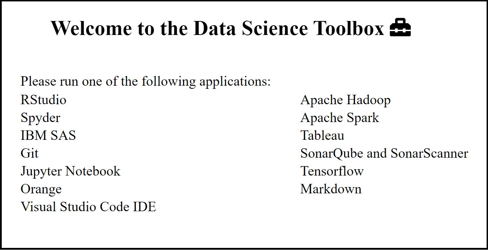

# Data Science Toolbox

This is a microservice application which runs different useful data science applications on containers with docker

## Dependencies
 Make sure you have [Docker](https://docs.docker.com/get-docker/) installed
 
You will also need [Docker-Compose](https://docs.docker.com/compose/install/), if your version of Docker does not have it preinstalled follow these instructions for your operating system to install it.
## Installation

Clone this repository

```git
git clone https://github.com/amcgaw07/CS1660_DSToolbox
```

## Usage
Navigate to the location of the copied repo in whichever CLI you choose and run docker-compose in detached mode
```bash
docker-compose up -d
```
## Applications Included:
### Main Toolbox
* Flask application with easy access to all other applications in the toolbox, simply select which program you'd like to use and it will run.
### RStudio
* RStudio is an integrated development environment for R, a programming language for statistical computing and graphics.
* Choosing this option opens up an RStudio Server 
### Spyder
* Unimplemented
### IBM SAS
* Toolbox redirects to the IBM SAS cloud service. 
* SAS is a statistical software suite developed by SAS Institute for data management, advanced analytics, multivariate analysis, business intelligence, criminal investigation, and predictive analytics.
* IBM SAS is a paid software, so it may not be useful for everyone.
	* if you have an account choose this option to go to their cloud service
### Git
* Utilizing the [Wetty](https://hub.docker.com/r/krishnasrinivas/wetty/) terminal on a docker container with Git installed, you can access Git through  the toolbox on your localhost
* Container mounts to directory where the compose file is run
* Simply cd twice until you see a directory labeled 'code' to find the files from the present directory mentioned above
* **Login to Wetty:** 
	* **Username:** term
	* **Password:** term
* Make sure you also configure git to your account if you are going to make and commit changes
	```git
	$ git config --global user.name "John Doe"
	$ git config --global user.email johndoe@example.com
	```

### Jupyter Notebook
* The Jupyter Notebook is an open-source web application that allows you to create and share documents that contain live code, equations, visualizations and narrative text.
* Choosing this option opens up a Jupyter Notebook server
* **Jupyter Notebook should automatically log you in, but if not, the token to login is:** ***easy***
### Orange
* Unimplemented
### Visual Studio Code IDE
* Unimplemented
### Apache Hadoop
* Unimplemented
### Apache Spark
* Unimplemented
### Tableau
* Toolbox redirects to Tableau cloud service.
* Tableau is a paid software so it may not be useful for everyone
* You can sign up for a free trial on their website but it will only last 14 days without purchasing Tableau offical software
### SonarQube and SonarScanner
* SonarQube is an open-source platform developed by SonarSource for continuous inspection of code quality to perform automatic reviews with static analysis of code to detect bugs, code smells, and security vulnerabilities on 20+ programming languages.
* Choosing this option of the toolbox will open the interactive screen for SonarQube.
* The main page should display results from a project titled **'Example of SonarQube Scanner Usage'**
	* SonarScanner will scan everything within the **sample folder** included in the repository, after initial run, restart the docker container to scan new files.
* **Login:** 
	* **Username:** admin 
	* **Password:** admin
### Tensorflow
* TensorFlow is a free and open-source software library for machine learning.
* Toolbox redirects to a Jupyter Notebook server with Tensorflow pre-installed
* Also comes packed with TensorFlow tutorial documents
* **Jupyter Notebook should automatically log you in, but if not, the token to login is:** ***easy***
### Markdown
* Markdown editor server
* Edit on the left and see live changes to your markdown styling on the right of the screen
### Notepad++
* Unimplemented
